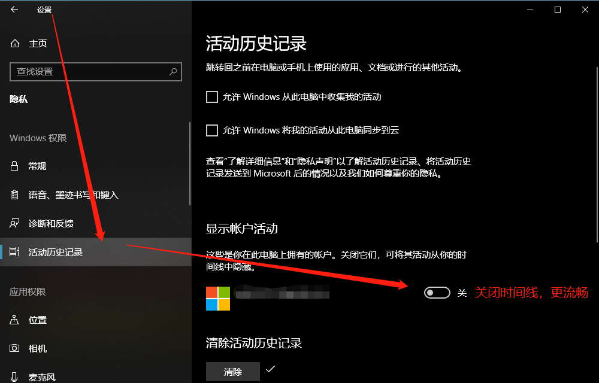

# Minimal Windows 10 Virtual Desktop Gesture: Right-Button-Ninja

> Choose Language：English ｜ [中文](https://github.com/hansenwangvip/right-button-ninja/edit/master/README.md)

Right-Button-Ninja is a mouse gesture software customized for Windows 10.

This software recognizes the four directions of mouse gestures to realize simulated touchpad gestures, helping users to manage virtual desktops more conveniently and quickly.

Just hold down the right mouse button and swipe, and you can experience it.

# Quick start

## Installation

This software does not need to be installed or set.
[click to download](https://github.com/hansenwangvip/right-button-ninja/releases/download/v1.0.1/RBN.right-button-ninja@1.0.1.zip), Run the exe file to experience.

## Demo

** Gesture usage: Start from any position, press and hold the right mouse button, then slide the mouse neatly, release the right button immediately. **

Swipe up gesture

Swipe down gesture

Left swipe gesture

4. Right swipe gesture

## use

### 5 key features

Starting from any position, hold down the right mouse button, then slide the mouse cleanly and immediately release the right mouse button.

1. Master switch: control the operation of pausing or resuming the software. Shortcut key `ALT + WIN + P`.
2. Swipe up: Show multitasking view.
3. Swipe down: Show desktop.
4. Swipe left: move to the virtual desktop on the right.
5. Swipe right: Move to the virtual desktop on the left.

### Accessibility

1. View help: `ALT + WIN + H`
2. View about: `ALT + WIN + L`

# Advanced techniques

Some commonly used advanced techniques:

1. In multitasking view, click the middle mouse button to close the desktop or window.
2. Swipe up to open the multi-tasking view. You can drag the window to other desktops.
3. How to make the script boot automatically?
1. Press the shortcut key: `WIN + R`
2. Enter `shell: startup` and press Enter
3. A folder window pops up
4. Then copy the RBN exe file into it, it will start automatically next time you boot
5. If you want to turn off auto-start, repeat steps 1, 2, and 3, and then delete the files that do not start automatically.
4. The new version of windows10 will display the timeline in the task view, which will reduce the performance of the virtual desktop. If you do n’t use the timeline, you can turn off your account timeline in "Settings-Privacy-Activity History-Show Account Activity" to improve the smoothness of the virtual desktop. Reference screenshot:

# About

This software is free forever, no ads, no bundled installation, industry conscience!

Compatibility: This software is only compatible with Windows 10 operating system.

This software is written by [AutoHotKey] (http://ahkcn.sourceforge.net/docs/Tutorial.htm), the code is open source, guaranteed non-toxic, and enjoyed with ease.

Source: <https://github.com/hansenwangvip/right-button-ninja>

** If you find it useful, welcome Star and publicity, your encouragement is my motivation, thanks! **

# Feedback

If you encounter any problems during use, you can raise an issue and I will try to reply within 24 hours.

# Permission

Right Ninja advocates minimalism, pursues simplicity, is free forever, and is green and non-toxic.

You can be like a ninja, the mouse is your sharp blade, and the gesture is your ninjutsu.

Right Button Ninja is licensed under the MIT license.

This means that you are free to modify and redistribute the program, but you must include the license and this statement in your version.

# Contribute code

1. Open the ** auto-hot-key-runtime.exe ** file after decompression and install the AHK environment;
2. Read [AHK Document] (http://ahkcn.sourceforge.net/docs/Tutorial.htm);
3. Create new branch and write ahk script;
4. Debugging: When writing ahk script, right-click the taskbar icon and click reload to reload the script;
5. Submit a Pull Request after development is complete.

# Reference link

> [# Multiple Desktops in Windows 10] (https://support.microsoft.com/en-us/help/4028538/windows-10-multiple-desktops)

> [# Do More with Multitasking in Windows 10] (https://support.microsoft.com/en-us/help/4026282/windows-10-get-more-done-with-multitasking)

> [# Official Microsoft: Touchpad Gestures for Windows 10] (https://support.microsoft.com/en-us/help/4027871/windows-10-touchpad-gestures)

> [# PC online article: "Double system in one second? Win10 Virtual Desktop Detailed Tutorial '') (https://www.pconline.com.cn/win8/560/5608916_all.html)
